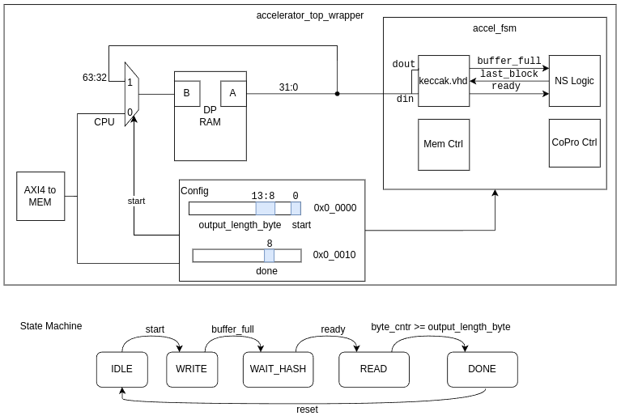

# SHAKE 128 Accelerator

Produces a hash of configurable length between 8 and 512 bit, in byte-increments. 

Reduced cycle count for hash generation from ~25,000 (SW) to 30 cycles (accelerator). Measured from start to done, when data is copied directly into the accelerator RAM.  

My Contributions:

## Hardware 

Created Finite State Machine
```
pulpino_clean/RTL/accelerator/accel_fsm.sv
```

Adapted Keccak Accelerator to SHAKE128
```
pulpino_clean/RTL/accelerator/keccak.vhd
```

Adapted ports
```
pulpino_clean/RTL/accelerator/accel_wrapper.sv
pulpino_clean/RTL/accelerator/accel_top_wrapper.sv
pulpino_clean/RTL/rtl/pulpino_top.sv
```

Wrote a testbench
```
pulpino_clean/RTL/accelerator/tb_accel_wrapper.sv
```

## Software

Driver and benchmark
```
pulpino_clean/COMPILE/src/bench_targets/main.c
```

## Physical Design Reports

Physical design with SkyWater 130 Low Speed Library.

Results:
- Gatecount:   583k
- Area:        2.8 mm²

Reports
```
pulpino_clean/reports/gatecount.rpt
pulpino_clean/reports/timing.rpt
```

## Block Diagram




